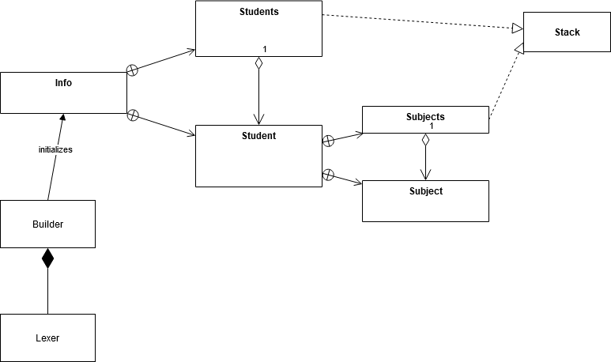

# OOP In Action: modelling university

This project is made for educational purposes.
Main goal: read, store and preprocess statistical data about educational process in university.
Complete description can be found in Description.pdf.

What is done:
- Low-lewel string parsing
- Reasonable design of main classes and relationships between them
- Coding Stack-container from scratch

